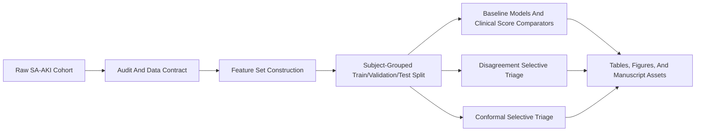
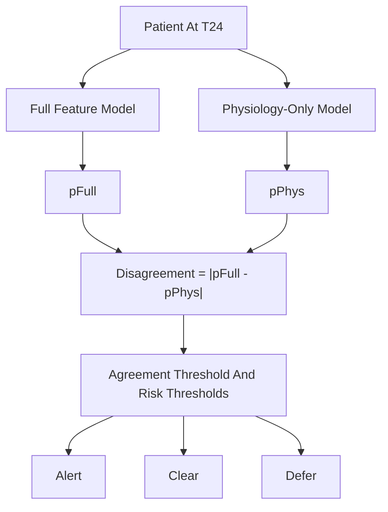

# Methods

## Study Design And Data Source

This retrospective study used `mimic_saaki_raw_v2.csv`, a T24 SA-AKI cohort derived from MIMIC. One row represents one ICU-stay-level SA-AKI record scored at 24 hours after ICU admission. The primary label is in-hospital mortality (`event_observed`), and the time-to-event variable is `time_to_event_hrs`. Because repeated patients remain in the cohort, all deployment claims use subject-grouped evaluation by `subject_id`.

## Cohort And Evaluation Workflow

**Figure 1. Cohort definition and evaluation workflow.**



## Baselines

Conventional baselines included logistic regression, LightGBM, and XGBoost. Calibration was selected on grouped validation data using the main pipeline. We also retained score-only comparators based on `SOFA` and `APACHE-III` if those columns were present, treating them as single-feature logistic baselines under the same grouped protocol.

The disagreement-based selective-triage comparator follows the earlier project draft. A process-enriched full model and a physiology-severity model are trained on the same grouped split. Cases are actionable only when the two models agree closely enough on grouped validation data.

## Conformal Selective Triage

The main method is Mondrian conformal prediction. A training subset fits the risk model, a separate calibration subset estimates nonconformity thresholds, and the test subset receives set-valued predictions. For binary mortality prediction, the prediction set can be one of three clinically interpretable outcomes:

- `{1}`: Alert
- `{0}`: Clear
- `{0,1}`: Defer

**Figure 3. Conformal selective-triage decision flow.**

```mermaid
flowchart TD
    patientCase["Patient At T24"] --> riskModel["Risk Model"]
    riskModel --> calibrationThresholds["Mondrian Conformal Thresholds"]
    calibrationThresholds --> predSet["Prediction Set"]
    predSet -->|"{1}" alertNode["Alert"]
    predSet -->|"{0}" clearNode["Clear"]
    predSet -->|"{0,1}" deferNode["Defer"]
```

## Disagreement Baseline

**Figure 4. Disagreement-based selective-triage comparator.**



## Metrics And Statistical Analysis

We reported AUROC, AUPRC, Brier score, expected calibration error, calibration intercept, calibration slope, recall at `PPV >= 0.50`, alert burden, and low-risk coverage. For conformal selective triage we reported coverage, certain-decision fraction, defer rate, alert PPV, clear NPV, and miss count. Subject-aware uncertainty was summarized with clustered bootstrap confidence intervals. Shift robustness was assessed by random missingness injection and by dropout of measurement-process and care-process feature families. Secondary horizon performance was also exported for the journal package.
